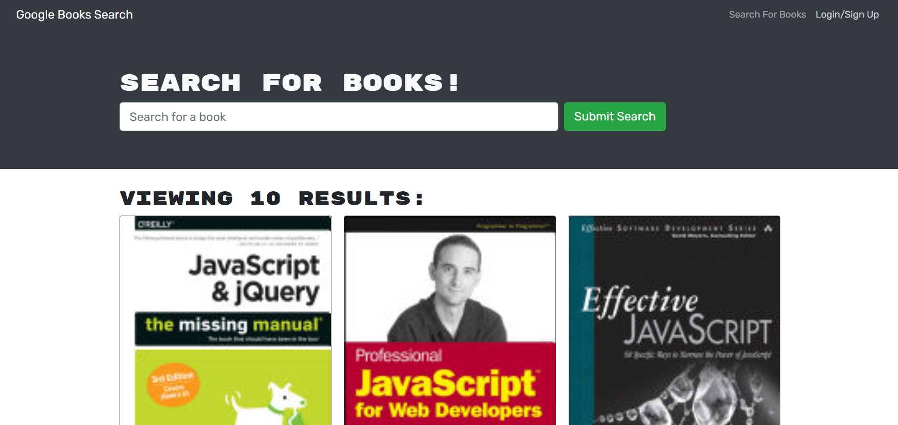

# 🏬 MERN Book Search

MERN Book Search is a fully functioning Google Books API search engine built with a RESTful API, and refactor it to be a GraphQL API built with Apollo Server. The app was built using the MERN stack with a React front end, MongoDB database, and Node.js/Express.js server and API.
  

 * _GitHub Repo:_ [https://github.com/ckinleydavis/mern-book-search](https://github.com/ckinleydavis/mern-book-search)
 * _Heroku Deployment:_ [https://mern-googlebook-search.herokuapp.com/](https://mern-googlebook-search.herokuapp.com/)
  

## 🎯 Objectives

* Use **MERN**: **MongoDB**, **Express Server**, **React.js**, and **Node.js**
* Use **RESTful API**, **GraphQL API**, and **Apollo Server**
  

## 📚 _User Stories_
As an avid reader I want to  | So that I may . . . . . . . . . 
---------------------------- | --------------------------------
search for new books to read | keep a list of books to purchase
 

## 🖼️ Wireframe
 

  

## 📹 Video Demonstration

**NOTE:** If the video does not appear below, try clicking [here](https://drive.google.com/file/d/1LvNemQLj20uyAa87XQCT_T9dXt9qEMgr/view) to view on [Google Drive](https://drive.google.com/file/d/1LvNemQLj20uyAa87XQCT_T9dXt9qEMgr/view). 
  

<video controls width="80%" align="center" src="./client/public/images/mern-google-book-search.webm" type="video/webm"> 
    Sorry, your browser doesn't support embedded videos.
</video>

  

## ❗❗ Issues

 1. Deployed code to Heroku and connected to MongoDB, however, signup and login functions return "Something went wrong with your login credentials!" or "Something went wrong with your signup!". Once fixed, the application should be fully functional.
